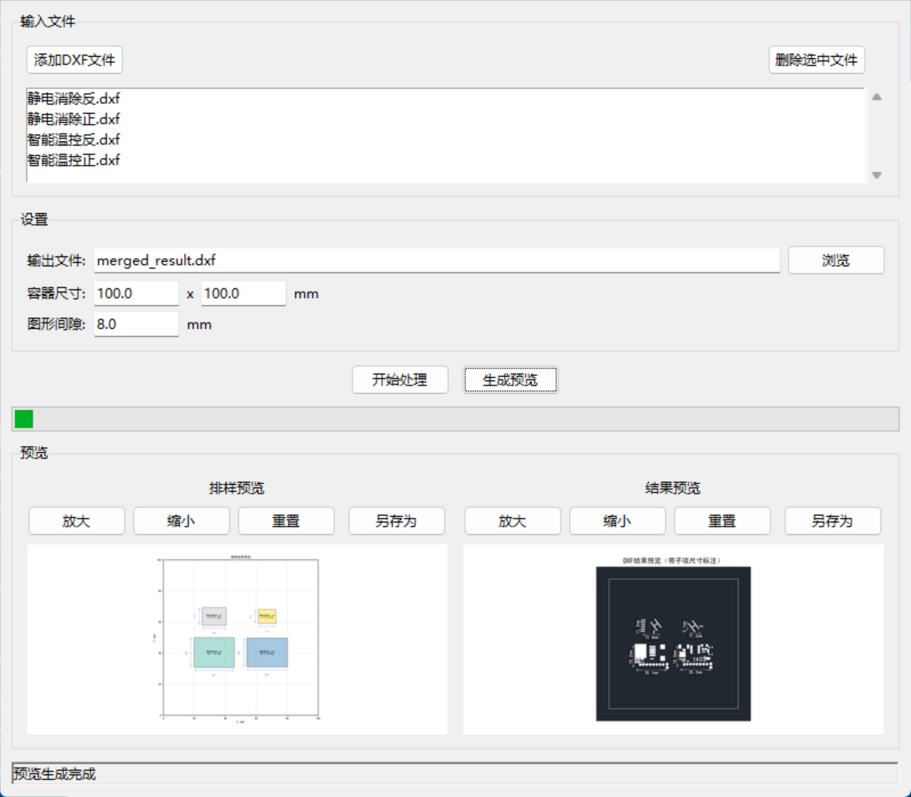
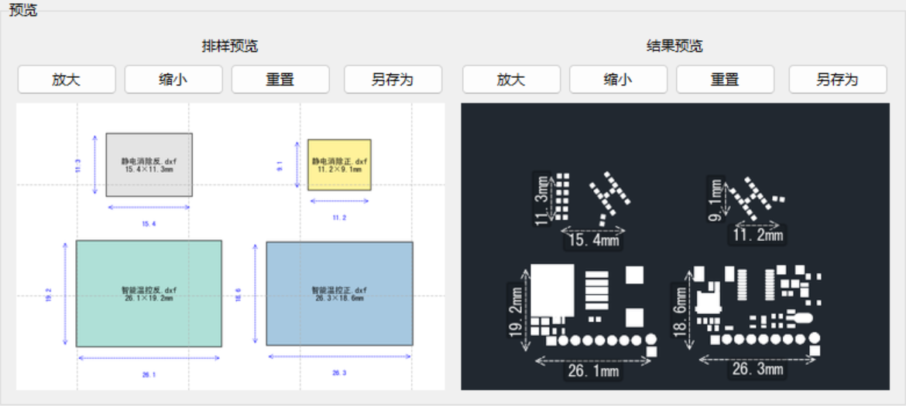

# DXF 文件合并工具

这是一个用于合并多个 DXF 文件并在指定区域内进行智能排样的工具。它支持图形化界面和命令行两种使用方式。

## 功能特点

- 读取多个 DXF 文件
- 自动计算每个文件的最小外包矩形
- 在指定区域内进行智能排样（从左到右，从上到下网格排列）
- 生成合并后的 DXF 文件
- 包含边框显示工作区域
- 生成排样预览图和结果预览图
- 支持图形化界面和命令行两种使用方式

## 安装依赖

```bash
pip install ezdxf numpy matplotlib
```

## 使用方法

### 方法1：图形化界面（推荐）

双击运行打包好的 Windows 可执行文件，或运行：

```bash
python gui_app.py
```

在图形界面中，您可以：
1. 添加需要合并的 DXF 文件
2. 设置输出文件路径
3. 调整容器尺寸和图形间隙
4. 点击"开始处理"进行合并
5. 生成并查看预览图

#### 界面

##### 放大效果


### 方法2：命令行

```bash
python main.py ./data/静电消除正.dxf ./data/静电消除反.dxf ./data/智能温控正.dxf output.dxf
```


## 排样算法说明

本工具采用网格排样算法：
1. 按照图形面积从大到小排序
2. 从左到右、从上到下按网格排列
3. 动态调整网格大小以适应不同尺寸的图形
4. 将排列好的整个网格居中摆放
5. 在图形之间保留指定间隙，便于后续加工处理

## 打包为 Windows 可执行文件

运行以下批处理文件即可打包：

```bash
build_exe.bat
```
或者
```bat
pyinstaller --noconfirm --onefile --windowed --name="DXF合并工具"     --add-data="dxf_processor.py;."     --add-data="dxf_renderer.py;."     --hidden-import="PIL"      gui_app.py
```

生成的可执行文件将位于 `dist` 目录中。

## 依赖库

- ezdxf: 用于处理 DXF 文件
- numpy: 数值计算
- matplotlib: 生成预览图

## 注意事项

1. 确保输入的 DXF 文件格式正确
2. 输出路径需要有写入权限
3. 若需要更好的中文字体支持，请确保系统安装了相应字体